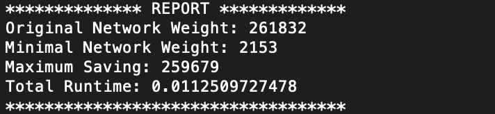

## Requirements
- Linux based system
- Download and install Docker[docker]. Create an account if you don't already have one.

## Steps to deploy the script in docker
- Login to docker registery (`docker login` in terminal)
- Go to source file,  and run following commands:

    - `docker build -t min_net_container .`
    (This command will create the container with name 'min_net_container')

    - `docker run min_net_container`

- The report will be printed as follows:

[docker]: https://www.docker.com/get-started
